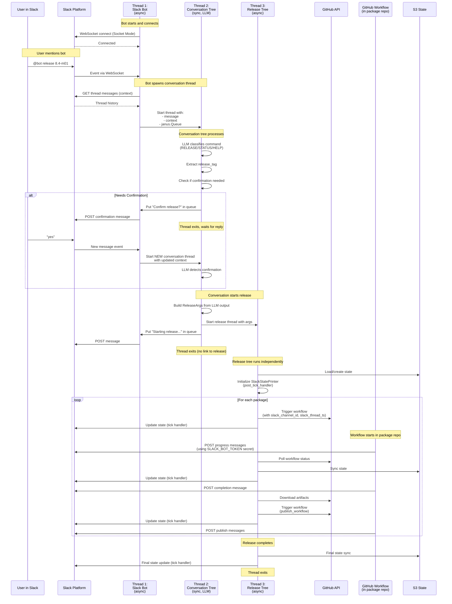

# Slack Bot Architecture

## Three Independent Threads

The system consists of three separate threads that communicate via queues and shared state:

1. **Slack Bot Thread** (async) - Listens to Slack events via WebSocket
2. **Conversation Tree Thread** (sync) - LLM-powered command classifier and router
3. **Release Tree Thread** (async) - Orchestrates the actual release process

## Release Process Flow

The following diagram shows the complete flow for a **release command** (e.g., `@bot release 8.4-m01`):

## Thread Responsibilities

### Thread 1: Slack Bot (async)
**File:** `src/redis_release/slack_bot.py`

**Responsibilities:**
- Maintain WebSocket connection to Slack (Socket Mode)
- Listen for `app_mention` and `message` events
- Fetch thread context (conversation history)
- Spawn new conversation threads for each user message
- Listen to janus.Queue and forward messages back to Slack
- Run independently, can handle multiple conversations simultaneously

**Key Point:** Bot does NOT process commands or run releases - it only routes messages!

### Thread 2: Conversation Tree (sync, LLM-powered)
**File:** `src/redis_release/bht/conversation_tree.py`

**Responsibilities:**
- Use OpenAI LLM to classify user intent (RELEASE/STATUS/HELP)
- Extract command arguments from natural language
- Determine if user confirmation is needed
- Show confirmation message if needed
- Build `ReleaseArgs` object from LLM output
- Spawn release thread when ready
- Exit after starting release (no ongoing link)

**Key Point:** Each user message creates a NEW conversation thread. LLM is REQUIRED (manual mode not fully implemented). Multiple conversations can run simultaneously.

### Thread 3: Release Tree (async)
**File:** `src/redis_release/bht/tree.py`

**Responsibilities:**
- Load/sync state from S3
- Orchestrate package builds and publishes
- Trigger GitHub workflows (build → publish)
- Monitor workflow status via polling
- Download artifacts between build and publish
- Post state updates to Slack on EVERY tick via `SlackStatePrinter`
- Sync state to S3 on every tick
- Run until all packages complete or error

## Communication Between Threads

### Bot ↔ Conversation
- **Link:** `janus.Queue` (bidirectional sync/async queue)
- **Direction:** Bot → Conversation (message + context), Conversation → Bot (replies)
- **Lifetime:** Queue exists only during conversation thread execution

### Conversation → Release
- **Link:** `ReleaseArgs` object passed to new thread
- **Direction:** One-way handoff
- **Lifetime:** No ongoing connection after release thread starts

### Release → Slack
- **Link:** Direct API calls via `SlackStatePrinter`
- **Direction:** Release → Slack (state updates)
- **Lifetime:** Independent, uses same channel_id/thread_ts from ReleaseArgs

## Credentials Required

### On EC2 (Running the Bot)

Required environment variables:
1. **`SLACK_BOT_TOKEN`** (xoxb-...) - For posting messages to Slack
2. **`SLACK_APP_TOKEN`** (xapp-...) - For WebSocket connection (Socket Mode)
3. **`OPENAI_API_KEY`** - For LLM-based command detection (REQUIRED)
4. **`GITHUB_TOKEN`** - For triggering workflows in package repos
5. **AWS credentials** - For S3 state storage (via IAM role or env vars)

### In GitHub Workflows (Package Repos)

Required secrets in each package repository:
1. **`SLACK_BOT_TOKEN`** - Same token as EC2 bot (stored as GitHub secret)
2. **`GITHUB_TOKEN`** - Automatically provided by GitHub Actions

## Slack Message Sources During Release

There are **three independent sources** of Slack messages during a release:

### 1. Conversation Tree Messages (via Bot Queue)
- **Source:** Conversation tree behaviors
- **Mechanism:** Messages added to `janus.Queue` → Bot reads and posts
- **Examples:** "Starting release...", "Confirm release?", error messages
- **Code:** `conversation_behaviours.py` → `slack_bot.py:create_queue_listener`

### 2. Release Tree Status Updates (Direct API)
- **Source:** `SlackStatePrinter` post-tick handler
- **Mechanism:** Direct Slack API calls via `WebClient`
- **Examples:** Live-updating status message with package progress (✅ ⏳ ❌)
- **Code:** `state_slack.py:SlackStatePrinter.update_message()`
- **Frequency:** Every tick (but only updates if state changed)

### 3. GitHub Workflow Messages (Direct API)
- **Source:** GitHub Actions workflows in package repos
- **Mechanism:** Workflows call `slack_send_with_token` bash function
- **Examples:** "Build started", "Tests passed", "Published to registry"
- **Code:** `.github/actions/common/slack.sh` (sourced by workflows)
- **Credentials:** Uses `SLACK_BOT_TOKEN` secret stored in package repo
- **Thread:** Uses `slack_channel_id` and `slack_thread_ts` passed as workflow inputs

**Key Point:** All three sources post to the **same Slack thread** using the same `SLACK_BOT_TOKEN`, but they operate completely independently!

