# Slack Bot Architecture

## Complete Flow: Slack Bot → EC2 → GitHub Workflow → Slack Thread

```mermaid
sequenceDiagram
    participant User as User in Slack
    participant Slack as Slack Platform
    participant EC2 as EC2 (redis-release bot)
    participant GH as GitHub API
    participant Workflow as GitHub Actions Workflow<br/>(in package repo)
    participant S3 as S3 (State Storage)
    
    Note over EC2: Step 1: Bot Initialization
    EC2->>Slack: WebSocket connect (Socket Mode)<br/>using SLACK_APP_TOKEN
    Slack-->>EC2: Connection established
    
    Note over User,Slack: Step 2: User mentions bot
    User->>Slack: @bot release start 8.4-m01
    Slack->>EC2: Push event via WebSocket
    
    Note over EC2: Step 3: Bot processes command
    EC2->>Slack: GET /conversations.replies<br/>using SLACK_BOT_TOKEN
    Slack-->>EC2: Thread context
    EC2->>EC2: Conversation tree classifies command
    EC2->>Slack: POST /chat.postMessage<br/>"Starting release..."
    
    Note over EC2,S3: Step 4: Release execution starts
    EC2->>S3: Load/create release state
    EC2->>EC2: Store slack_channel_id & slack_thread_ts<br/>in state.meta.ephemeral
    
    Note over EC2,GH: Step 5: Trigger workflow
    EC2->>GH: POST /repos/{repo}/actions/workflows/{file}/dispatches<br/>using GITHUB_TOKEN
    Note over EC2: Workflow inputs include:<br/>- release_tag<br/>- slack_channel_id<br/>- slack_thread_ts<br/>- workflow_uuid
    GH-->>EC2: 204 No Content
    EC2->>S3: Update state (workflow triggered)
    
    Note over Workflow: Step 6: Workflow runs
    GH->>Workflow: Start workflow in package repo
    Workflow->>Workflow: Build/test package
    
    Note over Workflow,Slack: Step 7: Workflow posts to Slack
    Workflow->>Workflow: Source .github/actions/common/slack.sh
    Workflow->>Slack: POST /chat.postMessage<br/>using SLACK_BOT_TOKEN (from secrets)<br/>channel: $slack_channel_id<br/>thread_ts: $slack_thread_ts
    Slack->>User: "Build completed ✅"
    
    Note over EC2,Workflow: Step 8: Bot monitors workflow
    EC2->>GH: GET /repos/{repo}/actions/runs/{run_id}<br/>Poll for completion
    GH-->>EC2: Workflow status
    EC2->>S3: Update state
    EC2->>Slack: POST /chat.postMessage<br/>"Workflow completed"
    
    Note over Workflow: Step 9: Workflow completes
    Workflow->>Workflow: Upload artifacts
    EC2->>GH: GET /repos/{repo}/actions/runs/{run_id}/artifacts
    EC2->>S3: Save final state
    EC2->>Slack: POST /chat.postMessage<br/>"Release complete! 🎉"
```

## Credentials Required

### On EC2 (Running the Bot)

Required environment variables:
1. **`SLACK_BOT_TOKEN`** (xoxb-...) - For posting messages to Slack
2. **`SLACK_APP_TOKEN`** (xapp-...) - For WebSocket connection (Socket Mode)
3. **`OPENAI_API_KEY`** - For LLM-based command detection (optional)
4. **`GITHUB_TOKEN`** - For triggering workflows in package repos
5. **AWS credentials** - For S3 state storage (via IAM role or env vars)

### In GitHub Workflows (Package Repos)

Required secrets in each package repository:
1. **`SLACK_BOT_TOKEN`** - Same token as EC2 bot (stored as GitHub secret)
2. **`GITHUB_TOKEN`** - Automatically provided by GitHub Actions

## Key Points

- **Bot and workflows are INDEPENDENT** but share the same Slack bot token
- **Thread context** (channel_id + thread_ts) is passed from bot to workflow as inputs
- **All messages appear in the same thread** because both use the same coordinates
- **Workflows post directly to Slack** without going through the bot

